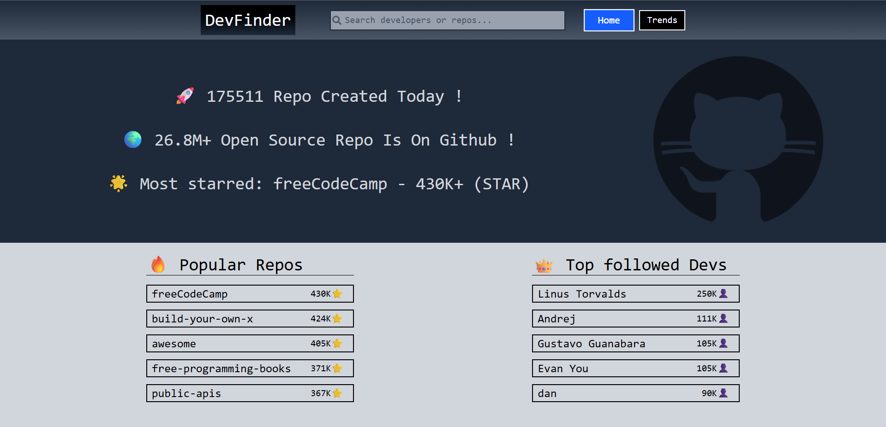

# 🔍 DevFinder

> A modern, full-featured GitHub explorer built with React 19, GraphQL, and REST API

DevFinder is a single-page application that allows users to discover trending developers, explore popular repositories, and search through GitHub's vast ecosystem with responsive interface.


## 🌐 [Live Demo](https://your-app-url.vercel.app)

> 🚀 **[Click here to view the live application](https://dev-finder-taupe.vercel.app/)** deployed on Vercel

---

## 📸 Screenshots

<p align="center">
  
  
</p>
---

## ✨ Features

- 🔍 **Real-time Search**: Debounced search across developers and repositories
- 📊 **Trending Dashboard**: View top followed developers and most starred repositories
- 👤 **Developer Profiles**: Detailed developer cards with bio, top languages, and pinned repos
- 📦 **Repository Details**: Comprehensive repo info including contributors, languages, topics, and stats
- 🎯 **Smart Navigation**: React Router v7 with data loaders for optimal UX
- 🎨 **Responsive Design**: Fully responsive web application, mobile-compatible with Tailwind CSS
- ⚡ **Performance Optimized**: Custom hooks, memoization, and efficient data fetching
- 🔄 **Infinite Scroll**: Load more functionality with pagination
- 🌐 **Hybrid API**: GraphQL for complex queries, REST for specific GitHub endpoints

---

## 🛠️ Tech Stack

### Core
- **React 19.1.0** - Latest React with concurrent features
- **Vite 7.0.4** - Lightning-fast build tool and dev server
- **React Router 7.6.3** - Advanced routing with data loaders

### Data Fetching
- **Apollo Client 3.13.8** - GraphQL client with intelligent caching
- **GraphQL 16.11.0** - GitHub GraphQL API v4 integration
- **Axios 1.10.0** - HTTP client for REST endpoints

### UI & Styling
- **Tailwind CSS 4.1.11** - Utility-first CSS framework
- **Radix UI** - Accessible, unstyled component primitives
- **Lucide React** - Beautiful icon library
- **React Icons** - Popular icon library

### Utilities
- **date-fns 4.1.0** - Modern date utility library
- **number-abbreviate** - Format large numbers (1.2K, 3.5M)
- **github-colors** - Official GitHub language colors
- **clsx & tailwind-merge** - Conditional className utilities

### Development
- **ESLint 9.30.1** - Code linting with React rules
- **Vite Plugin React** - Fast refresh and JSX support

---

## 🏗️ Architecture

### Project Structure
```
src/
├── api/                    # GraphQL queries & API client
│   ├── client.js          # Apollo Client configuration
│   ├── searchId.js        # Universal search query
│   ├── popularRepos.js    # Trending repositories query
│   ├── topFollowedDevs.js # Top developers query
│   └── index.js           # API exports
│
├── components/            # React components
│   ├── SearchBar.jsx      # Debounced search with dropdown
│   ├── SearchResults.jsx  # Search results display
│   ├── DeveloperCard.jsx  # Developer listing card
│   ├── RepositoryCard.jsx # Repository listing card
│   ├── DeveloperDetailCard.jsx  # Full developer profile
│   ├── RepositoryDetailCard.jsx # Full repository details
│   ├── TrendCards.jsx     # Trending items grid
│   └── ...
│
├── hooks/                 # Custom React hooks
│   ├── useDebounce.js     # Debounce hook for search
│   ├── useSearch.js       # Search logic & state
│   ├── useSearchId.js     # Node ID search & navigation
│   ├── useLoadMore.js     # Infinite scroll pagination
│   └── useListingData.js  # Data transformation hook
│
├── pages/                 # Route pages
│   ├── Home/
│   │   ├── Home.jsx       # Homepage component
│   │   └── homeLoader.js  # Data loader for homepage
│   ├── Trends/
│   │   ├── Trends.jsx     # Trends page component
│   │   └── trendsLoader.js # Data loader for trends
│   └── DetailsPage/
│       ├── DetailPage.jsx        # Universal detail page
│       ├── developerLoader.js    # Developer data loader
│       └── repositoryLoader.js   # Repository data loader
│
├── contexts/              # React Context API
│   └── context.jsx        # Search ID context provider
│
├── Layouts/               # Layout components
│   └── MainLayout.jsx     # Main app layout with Navbar
│
└── assets/                # Static assets & utilities
    └── symbols.js         # Unicode symbols & icons
```

### Key Architectural Decisions

#### 1. **React Router v7 Loaders Pattern**
Using modern data loading pattern for improved UX:
```javascript
const router = createBrowserRouter(
  createRoutesFromElements(
    <Route path="/" element={<MainLayout />}>
      <Route index element={<Home />} loader={homepageLoader} />
      <Route path="/trends" element={<Trends />} loader={trendsLoader} />
      <Route path="/developer/:username" loader={developerLoader} />
    </Route>
  )
);
```


#### 2. **Hybrid API Strategy**
Combining GraphQL and REST for optimal data fetching:
- **GraphQL (Apollo Client)**: Complex queries, related data, pagination
- **REST API**: GitHub-specific endpoints (contributors, rate limits)

Example GraphQL query:
```graphql
query searchId($id: ID!) {
  node(id: $id) {
    ... on User {
      name, bio, followers, repositories
    }
    ... on Repository {
      name, description, stargazers, languages
    }
  }
}
```
---

## 🚀 Getting Started

### Prerequisites
- Node.js 18+ 
- npm or yarn
- GitHub Personal Access Token (PAT)

### Installation

1. **Clone the repository**
```bash
git clone https://github.com/yourusername/dev-finder.git
cd dev-finder
```

2. **Install dependencies**
```bash
npm install
```

3. **Setup environment variables**

Create a `.env` file in the root directory:
```env
VITE_GITHUB_TOKEN=your_github_personal_access_token_here
```

**How to get GitHub Token:**
1. Go to GitHub Settings → Developer Settings → Personal Access Tokens
2. Generate new token (classic)
3. Select scopes: `public_repo`, `read:user`
4. Copy the token to your `.env` file

⚠️ **Security Note**: In production, use a backend proxy to hide your token!

4. **Run development server**
```bash
npm run dev
```

5. **Build for production**
```bash
npm run build
npm run preview
```

---

## 🎯 Key Features

###  **Real-time Search with Debouncing**
The search bar uses a custom `useDebounce` hook to prevent excessive API calls:

###  **Universal Detail Page**
- Uses dynamic routing: `/developer/:username` and `/repository/:owner/:name`
- Conditional rendering based on route type
- Smart data loading with fallback to context

### **Infinite Scroll Pagination**
`useLoadMore` hook implements cursor-based pagination

### **Responsive Design**
Fully responsive web application, optimized for desktop and mobile devices with Tailwind CSS breakpoints

## 📱 Application Pages

### Homepage - Trending Dashboard
- Daily repository count
- Total GitHub repositories
- Most starred repository
- Top 5 popular repos
- Top 8 followed developers

### Search Functionality
- Real-time search results
- Separate tabs for users and repositories
- Avatar previews
- Quick navigation to profiles

### Developer Profile
- Bio, location, company info
- Follower/following stats
- Top 3 programming languages
- 6 pinned repositories
- Direct GitHub link

### Repository Details
- Owner info and description
- Stars, forks, issues, watchers
- Language breakdown with percentages
- Top 6 contributors with avatars
- Repository topics
- License info and file size

---

## 🔧 Configuration

### ESLint Configuration
The project uses ESLint 9 with React-specific rules:
```javascript
// eslint.config.js
export default defineConfig([
  {
    extends: [
      js.configs.recommended,
      reactHooks.configs['recommended-latest'],
    ],
    rules: {
      'no-unused-vars': ['error', { varsIgnorePattern: '^[A-Z_]' }],
    },
  },
]);
```

### Apollo Client Setup
```javascript
const client = new ApolloClient({
  link: new HttpLink({
    uri: 'https://api.github.com/graphql',
    headers: {
      authorization: `Bearer ${import.meta.env.VITE_GITHUB_TOKEN}`,
    },
  }),
  cache: new InMemoryCache(),
});
```

---

## 🎨 UI/UX Features
- **Loading States**: Spinners and skeletons for better perceived performance
- **Error Handling**: User-friendly error messages
- **Hover Effects**: Smooth transitions and scale animations
---

## 📦 Build & Deployment

### Build Optimization
```bash
npm run build
```
Vite automatically:
- Code splits routes
- Minifies JavaScript and CSS
- Optimizes assets
- Generates source maps

### Deployment Options
- **Vercel**: `vercel --prod`
- **Netlify**: `netlify deploy --prod`
- **GitHub Pages**: Configure base path in `vite.config.js`

---